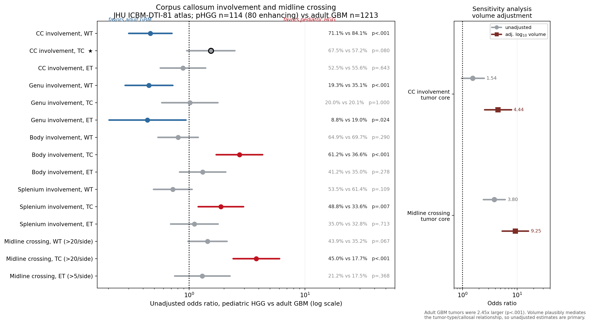
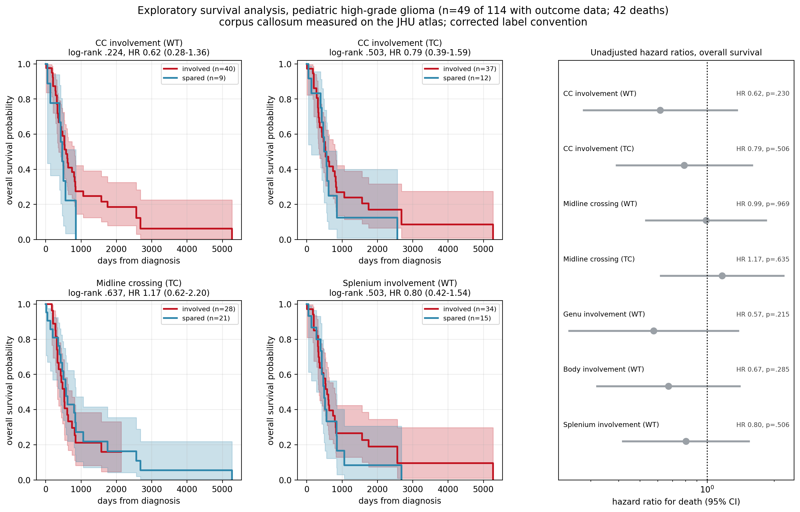
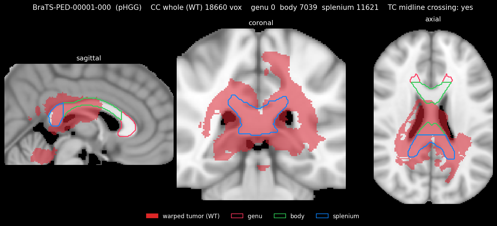
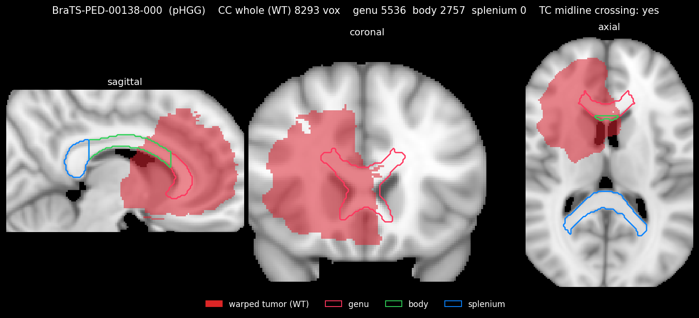
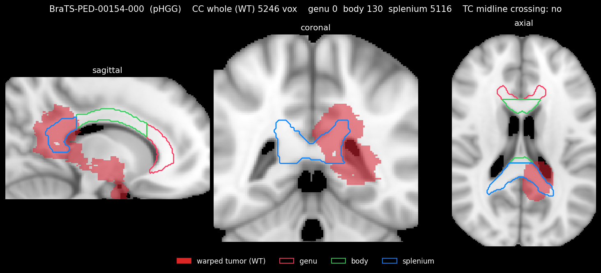
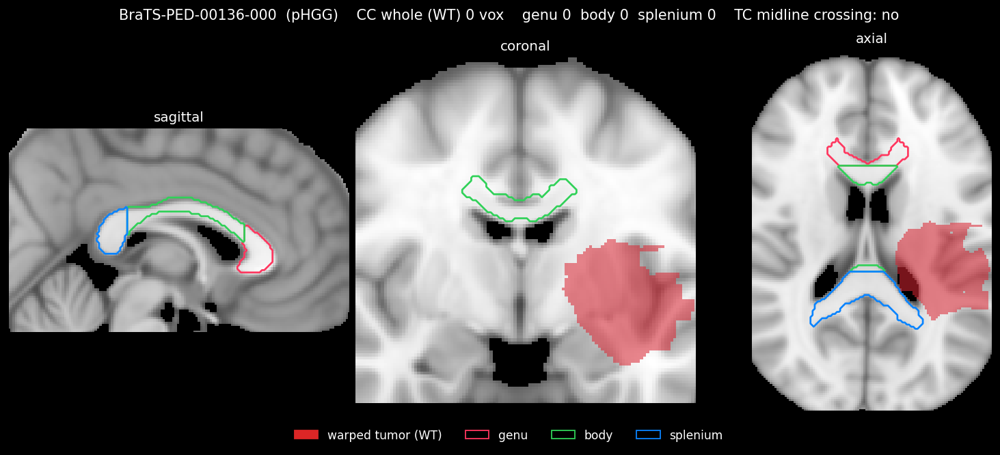
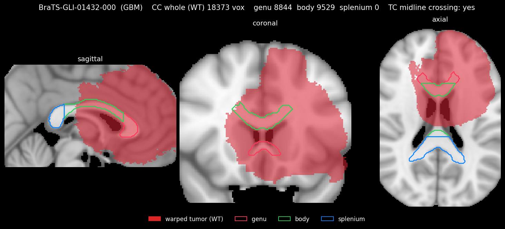
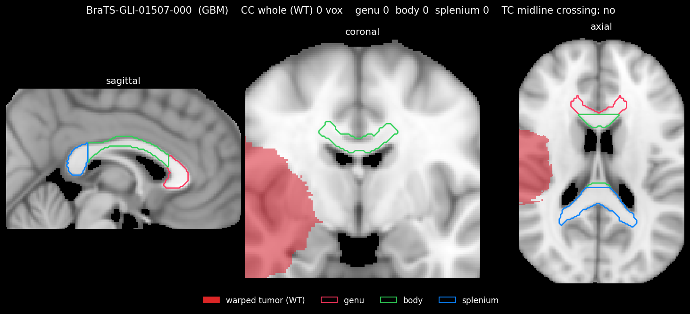
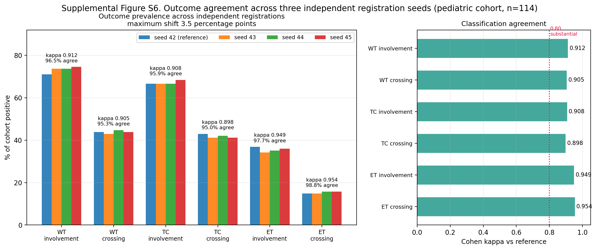

# Corpus Callosum Involvement in Pediatric HGG vs Adult GBM

Pediatric high-grade gliomas reach the corpus callosum less often than adult
glioblastomas (71.1% vs 84.1%), which is largely a function of tumor size, yet
they push solid tumor core across the midline 2.5 times as often (45.0% vs
17.7%, P < .001). Involvement is posterior in children, in the body and
splenium, and anterior in adults, in the genu.

## Method

For each case the pipeline registers the post-contrast T1 to the ANTs MNI152
template using SyNRA, with a cost-function mask that excludes the tumor. It then warps the expert segmentation into
template space with nearest-neighbor interpolation, which keeps the label values
exact. Overlap with the corpus callosum and its three sub-regions is then computed.

## Segmentation label conventions

| | BraTS-PEDs | BraTS-GLI (adult) |
|---|---|---|
| 1 | Enhancing tumor | Necrotic core |
| 2 | Non-enhancing tumor | Peritumoral edema |
| 3 | Cystic component | Enhancing tumor |
| 4 | Peritumoral edema | not used |

## Data

Pediatric imaging comes from the BraTS-PEDs collection on TCIA,
https://www.cancerimagingarchive.net/collection/brats-peds/. Extract it so each
case is a folder holding `<id>-t1c.nii.gz` and `<id>-seg.nii.gz`. Adult imaging
comes from the BraTS 2023 challenge on Synapse and needs a free account and an
access token.

Cohort selection also needs `BraTS-PEDs_metadata.tsv` and the CBTN
`histologies.tsv`.

## Measurements

Cases with any overlap in each region. WT is whole tumor, TC is tumor core, ET is
enhancing tumor. TC and ET rows use the enhancing pediatric subgroup (n=80),
whole-tumor rows use all 114.

| Metric | pHGG | Adult GBM (n=1213) |
|--------|------|--------------------|
| CC whole, WT | 81 (71.1%) | 1020 (84.1%) |
| CC whole, TC | 54 (67.5%) | 694 (57.2%) |
| CC whole, ET | 42 (52.5%) | 674 (55.6%) |
| CC genu, WT | 22 (19.3%) | 426 (35.1%) |
| CC genu, TC | 16 (20.0%) | 244 (20.1%) |
| CC body, WT | 74 (64.9%) | 845 (69.7%) |
| CC body, TC | 49 (61.2%) | 444 (36.6%) |
| CC splenium, WT | 61 (53.5%) | 745 (61.4%) |
| CC splenium, TC | 39 (48.8%) | 408 (33.6%) |
| Midline crossing, WT | 50 (43.9%) | 427 (35.2%) |
| Midline crossing, TC | 36 (45.0%) | 215 (17.7%) |
| Midline crossing, ET | 17 (21.2%) | 212 (17.5%) |

Prevalence ratios with raw and Benjamini-Hochberg adjusted p-values are in
`results/cc_results_v3.csv`.

## Statistics

Four methods, one per question.

| Method | Question |
|---|---|
| Fisher exact with Benjamini-Hochberg | Do the cohorts differ in the proportion involved, across 15 outcomes |
| Prevalence ratio with 95% CI | How large is the difference |
| Mann-Whitney U | Do tumor volumes, and the fraction of corpus callosum involved, differ |
| Modified Poisson regression | Does the difference survive adjustment for tumor volume |

Prevalence ratios rather than odds ratios because the design is cross-sectional
and the outcomes are common (18% to 84%), where an odds ratio overstates the
difference. Modified Poisson is Poisson regression with robust standard errors,
giving an adjusted prevalence ratio for the same reason.

Tumor core midline crossing is the pre-specified primary outcome and is reported
unadjusted; the other 14 carry a Benjamini-Hochberg adjusted p-value.

## Results

pHGG n=114 (80 enhancing), adult GBM n=1213. Five of 15 outcomes survive
correction.

| Finding | pHGG | GBM | PR (95% CI) | P | P (BH) |
|---|---|---|---|---|---|
| **Midline crossing, TC (>20/side)** | 45.0% | 17.7% | 2.54 (1.94-3.32) | <.001 | <.001 |
| **Body involvement, TC** | 61.2% | 36.6% | 1.67 (1.38-2.02) | <.001 | <.001 |
| **Genu involvement, WT** | 19.3% | 35.1% | 0.56 (0.38-0.81) | <.001 | .003 |
| **CC involvement, WT** | 71.1% | 84.1% | 0.84 (0.75-0.95) | <.001 | .004 |
| **Splenium involvement, TC** | 48.8% | 33.6% | 1.45 (1.14-1.84) | .007 | .022 |

Everything else was non-significant after correction, including all
enhancement-based comparisons and whole-tumor midline crossing (P = .067).

### Corpus callosum fraction involved

Treating involvement as a continuous measure rather than a threshold, and
restricting to cases with any involvement, pediatric tumor core occupies 8.7% of
the corpus callosum against 5.5% for adults (Mann-Whitney U, P = .0009). Children
do not only cross the midline more often, they occupy more of the structure when
they do.

### What this means

Adult tumors reach the corpus callosum more often overall (84.1% vs 71.1%), which
is largely size: adult tumors were 2.45 times larger (Mann-Whitney U, P < .001),
and the difference does not survive adjustment for tumor volume.

The compartment matters more than the rate. Pediatric tumors put solid tumor core
across the midline 2.5 times as often as adult tumors, and this is the strongest
and most robust result in the analysis.

The two cohorts also involve opposite ends of the structure. Pediatric
involvement is posterior, in the body and splenium. Adult involvement is
anterior, in the genu, which matches what the butterfly glioma literature has
long described. Among cases with any callosal involvement, pediatric tumors
occupy 10.6% genu / 45.6% body / 43.8% splenium, against 26.0% / 42.5% / 31.5%
for adults.

Enhancement-based measures show no difference between cohorts at any threshold,
so post-contrast appearance alone does not distinguish the two patterns.

### Survival

Exploratory, in the 49 patients with outcome data (42 deaths, median OS 527
days). Callosal involvement was not associated with overall survival for any
compartment or sub-region, including tumor core midline crossing (HR 1.17,
95% CI 0.62-2.20, P = .64). Event-free survival showed no association either.

Methylation classification was available for 37 patients, 23 at the DKFZ
confidence threshold. Survival did not differ between H3 K27-altered tumors and
other pediatric high-grade gliomas (HR 1.33, P = .63, n=17). No K27-altered tumor
involved the genu (0/12) compared with 3 of 5 other pediatric tumors (P = .015),
consistent with the posterior pattern above.

Per-predictor statistics are in `results/TableS7_survival_os.csv` and
`TableS7_survival_efs.csv`.

## Registration to MNI152 space

| Case | Cohort | CC whole (WT) | Genu (WT) | Splenium (WT) | TC crossing |
|------|--------|---------------|-----------|---------------|-------------|
| BraTS-PED-00001-000 | pHGG | 18660 | 0 | 11621 | yes |
| BraTS-PED-00138-000 | pHGG | 8293 | 5536 | 0 | yes |
| BraTS-PED-00154-000 | pHGG | 5246 | 0 | 5116 | no |
| BraTS-PED-00136-000 | pHGG | 0 | 0 | 0 | no |
| BraTS-GLI-01432-000 | GBM | 18373 | 8844 | 0 | yes |
| BraTS-GLI-01507-000 | GBM | 0 | 0 | 0 | no |

## Reproducibility

We registered the pediatric cohort three more times with different random seeds.
The derived classifications agreed 95% to 99% of the time, with Cohen kappa
between 0.90 and 0.95, and prevalence never shifted by more than 3.5 percentage
points.

## References

The corpus callosum masks come from the JHU ICBM-DTI-81 white matter atlas,
labels 3, 4 and 5, already on the MNI152 grid we register to. Mori et al., *MRI
Atlas of Human White Matter*, Elsevier 2005, and Hua et al., *NeuroImage*
2008;39(1):336-347. `atlas_jhu/PROVENANCE.md` records the source and the checks
we ran on it.

Pediatric imaging and its label convention are described in Kazerooni et al.,
arXiv:2305.17033 and arXiv:2404.15009, with the DFCI-BCH-BWH-PEDs-HGG subset
under TCIA doi:10.7937/v8h6-bg25. Adult imaging is the BraTS 2023 adult glioma
challenge set. Histologies come from the Children's Brain Tumor Network.
